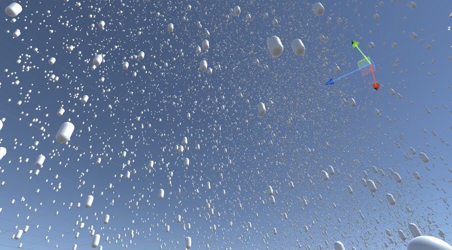

# Mini_Multithreading
Unity procedural generation demonstrating typical noise-based procedural generation, minecraft procedural generation and other techniques.

<!-- ABOUT THE PROJECT -->
## About The Project

This project is a mini project undertaken to experiemnt and learn development using C# threading on Unity's platform. This will involve usage of simple agents and possible threading pools to remove task load on the main thread. 

However this project will not undertake development in Unity's Job system as it is unstable for the 2020.3.0f release.

### Built With

This section should list any major frameworks that you built your project using. Leave any add-ons/plugins for the acknowledgements section. Here are a few examples.
* [C#](https://docs.microsoft.com/en-us/dotnet/csharp/)
* [Unity](https://unity.com/)

<!-- CONTACT -->
## Contact

Twitter - [@ChicoteJaiden](https://twitter.com/ChicoteJaiden)
Instagram - [@mr_i_art](https://www.instagram.com/mr_i_art/)
Itch.io - (https://jaidenchicote.itch.io/)
